# Deeke抖音黑科技

我们是全国唯一一家，实现贴牌自动化的科技公司！！！

<h3 style="color:#66F;">联系方式：请下拉到页面末尾！！！</h3>

Deeke作为“嘀客”的升级版本，稳定性等方面有较大提升；软件的用户体验也有许多的提升。这个版本总体来说有以下几大改变：

> 摒弃原Autojs框架，采用我们自主研发的DeekeScript框架；稳定性有较大提升

> 贴牌支持自定义主题（配色整体变更）

> 功能进行全面的简化，只保留用户最关心的功能

> 支持支付宝在线支付

> 支持智能评论、角色评论

> 支持功能定制（包括群控等）

Deeke支持后台一键贴牌，你不需要懂技术，只需要提供logo，后台就能给你自动生成一个和Deeke一模一样的黑科技软件，并且自带后台。我们的技术通过不断努力，终于把市场价几万的贴牌干到几千👍🏻👍🏻👍🏻，有兴趣从事这个行业的；可以相互交流😄～

tips: 如果你想加入我们，或者成为我们的兼职销售，请和我们联系～

## 以下是Deeke的截图：

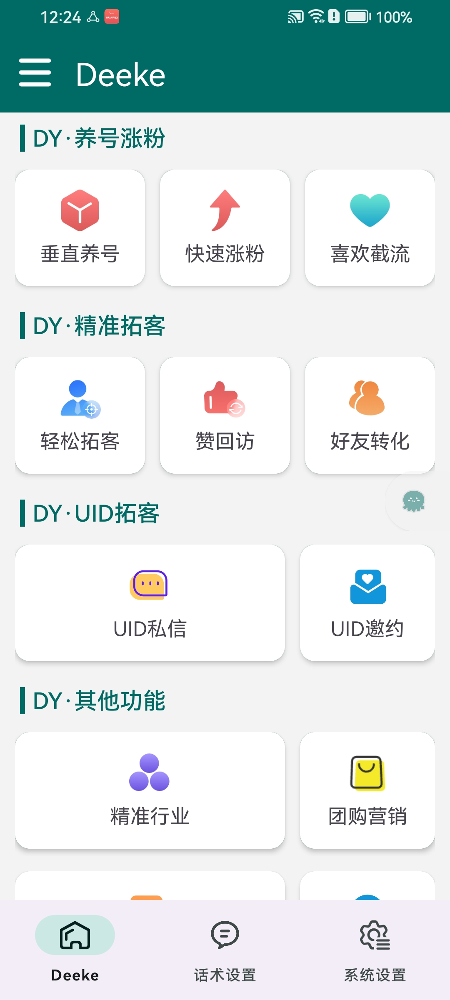
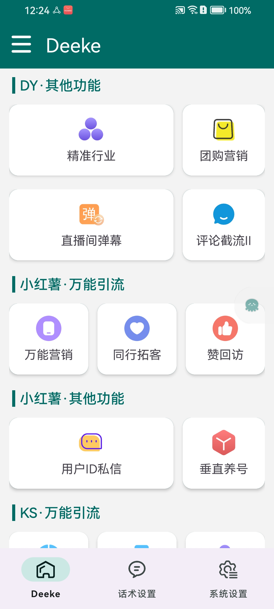
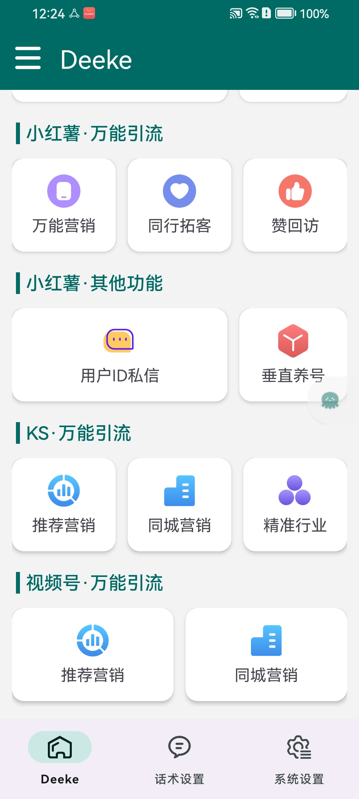

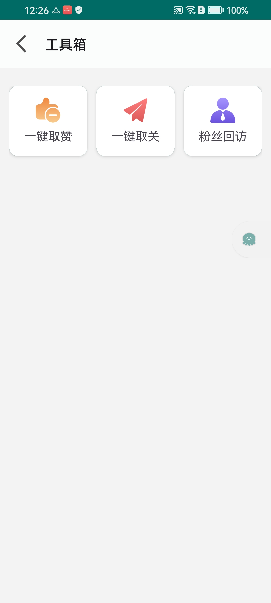
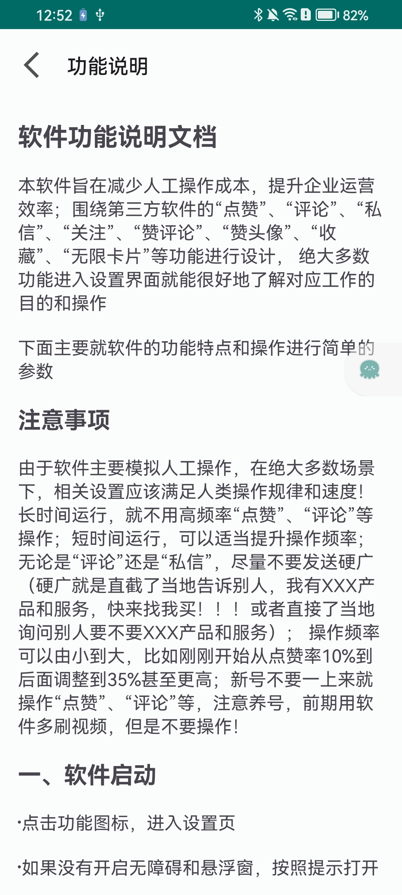
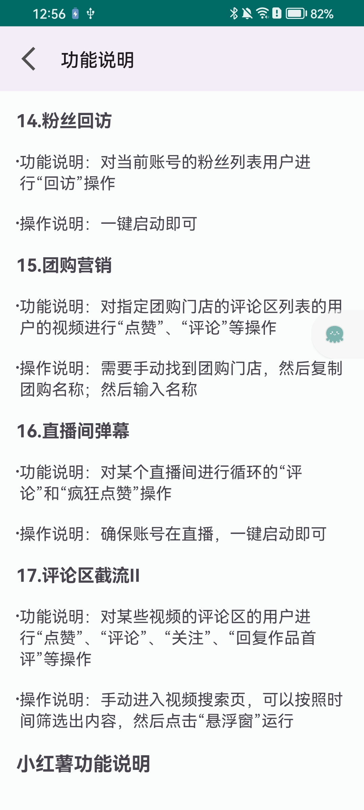
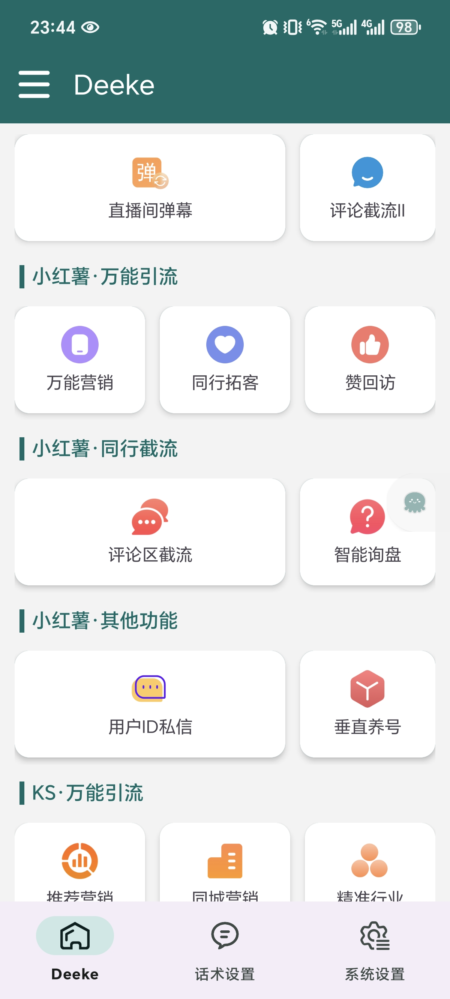

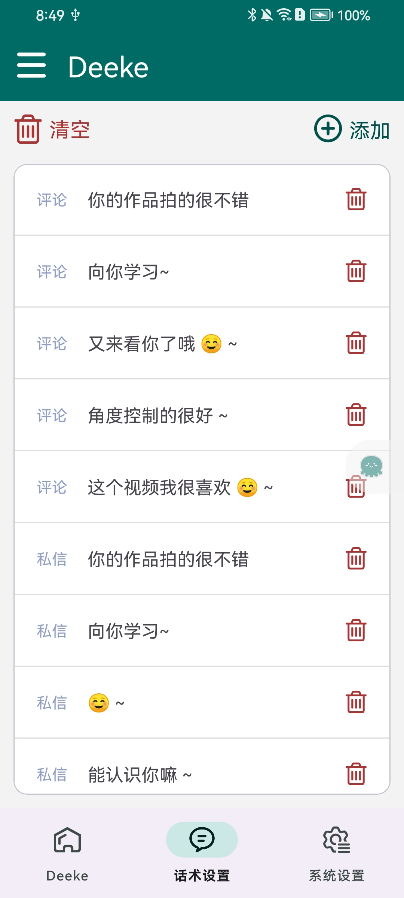
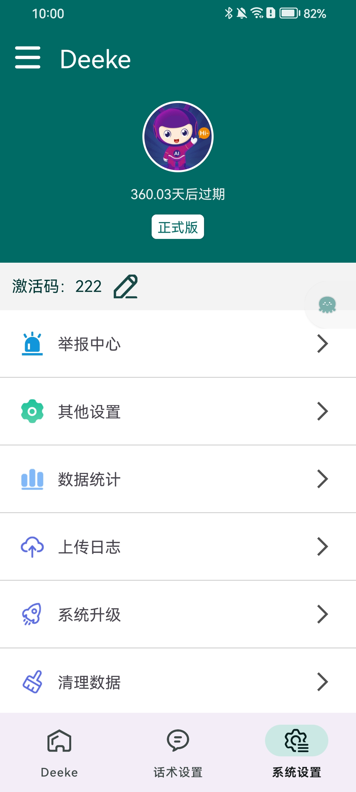
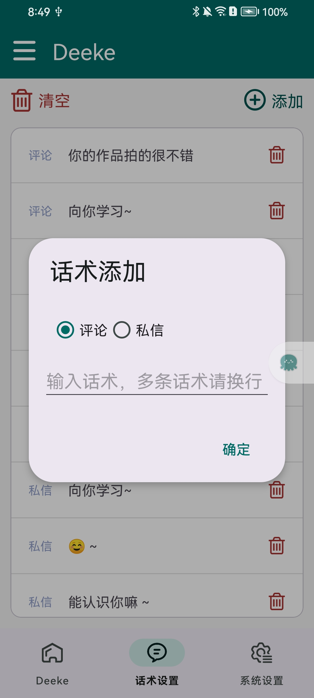
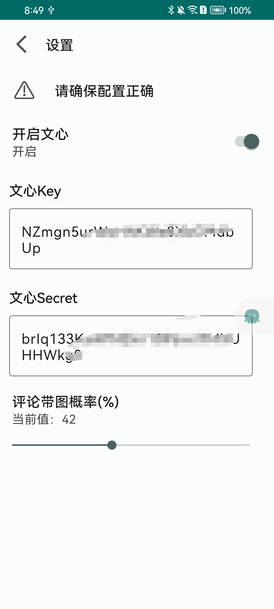

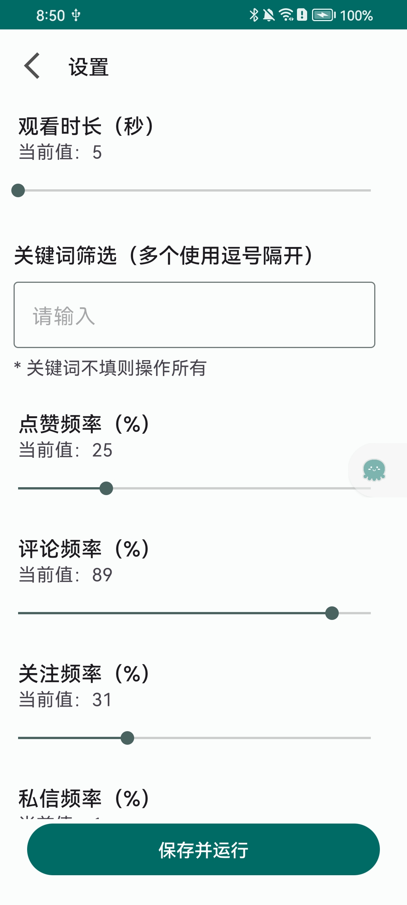
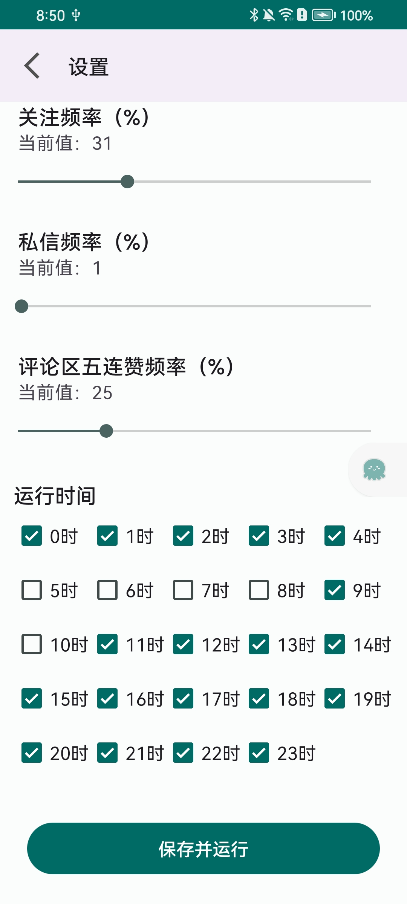
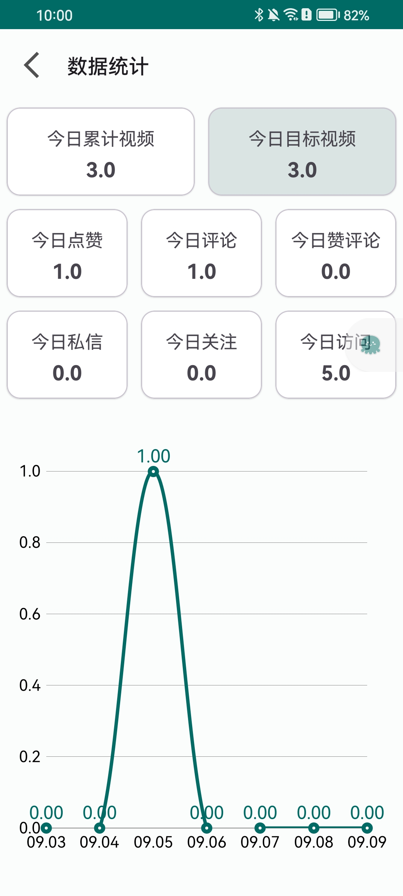
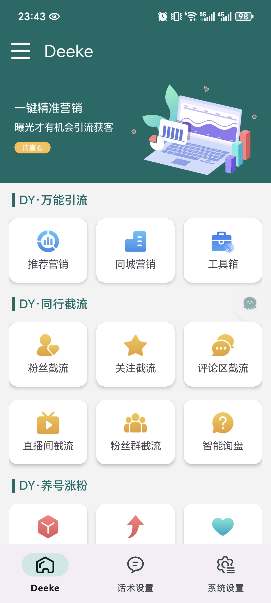

## 后台还是沿用之前的，截图：

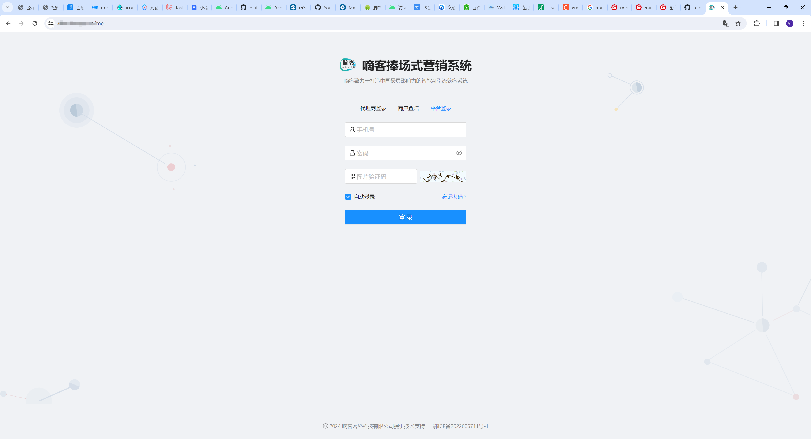
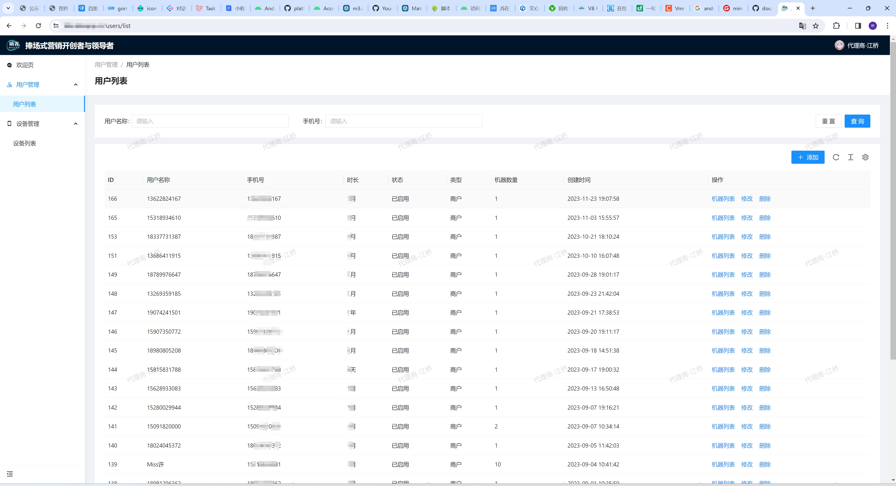

### 贴牌或者其他定制需求以及想加入团队的销售，请联系作者

